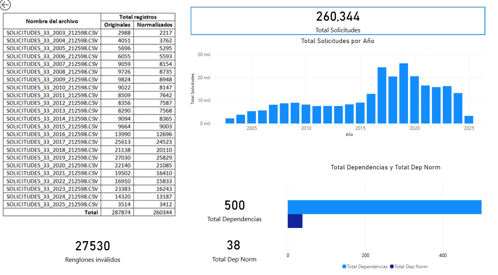
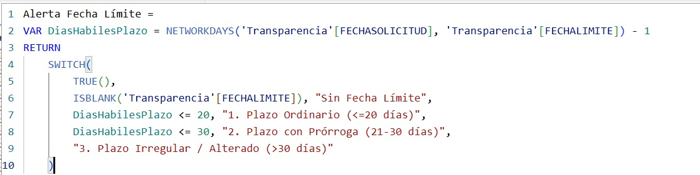
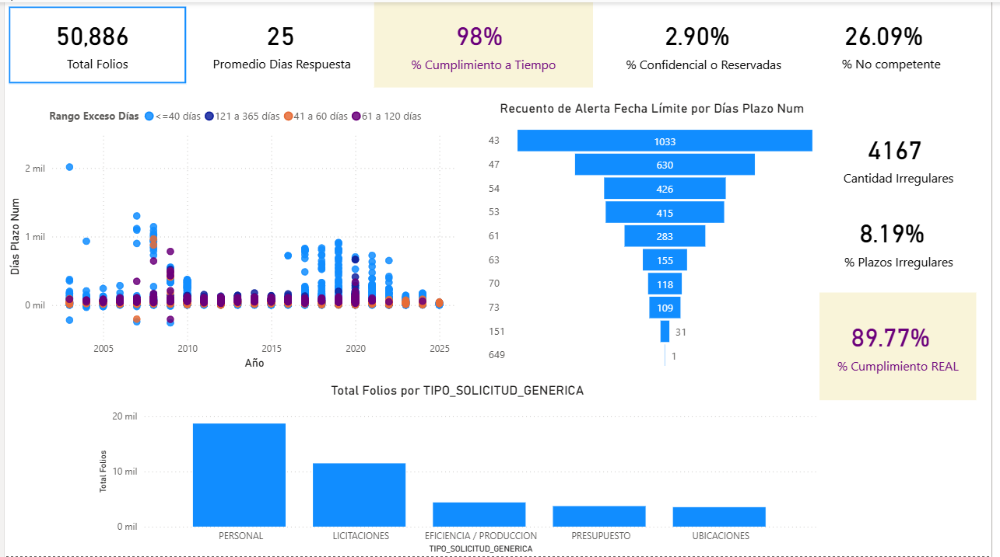
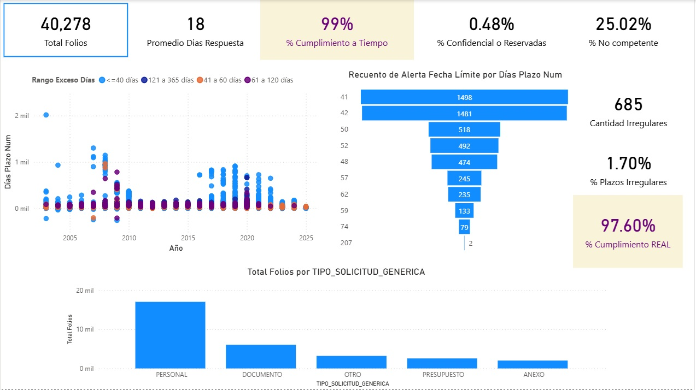
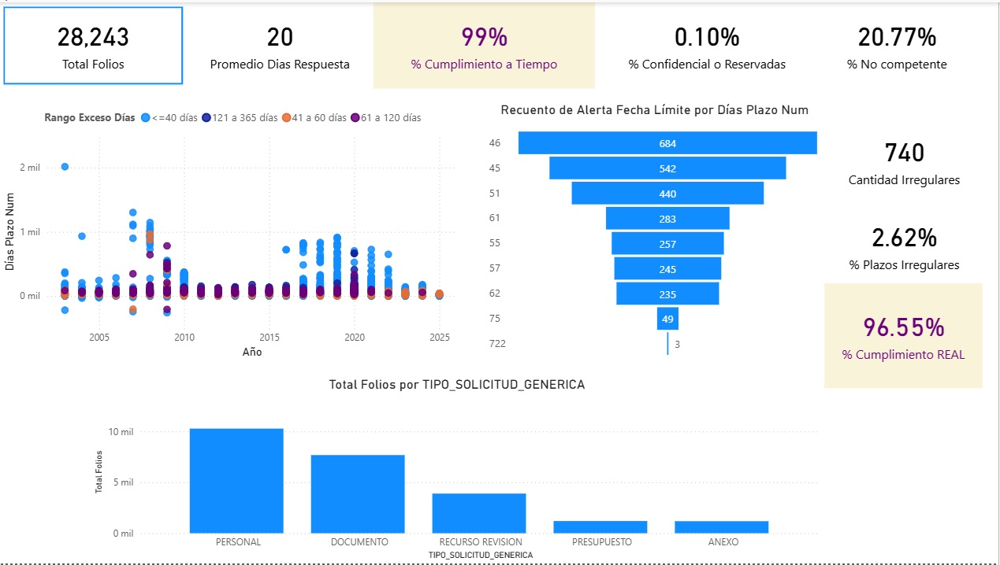
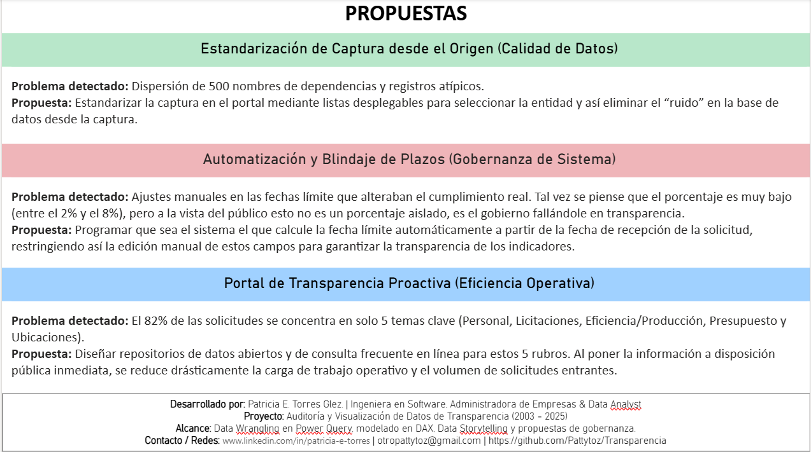
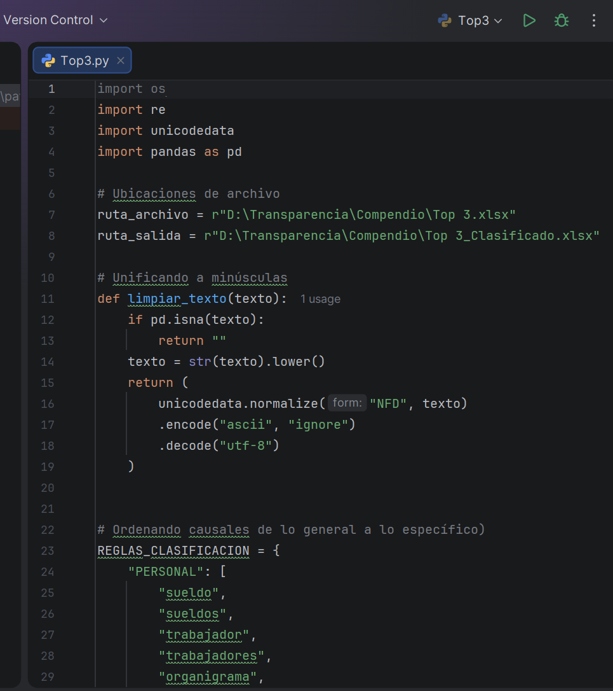

**TÍTULO DEL PROYECTO** 
Proyecto de Auditoría de Datos y Business Intelligence: Registro de Transparencia Pública (2003–2025).

**ENLACE AL VIDEO** https://youtu.be/zAQIQUcIZG8

**RESUMEN EJECUTIVO** 
Análisis integral y auditoría de calidad sobre un conjunto de más de 260,000 registros históricos de solicitudes de información pública. El objetivo principal del proyecto consistió en evaluar la integridad de los datos, medir los tiempos reales de respuesta institucional y diseñar propuestas de arquitectura de software para optimizar la gobernanza del sistema.

**PUNTOS CLAVE**

* ETL & Data Wrangling: Depuración y estandarización de más de 500 variantes de nombres de dependencias públicas mediante Power Query.
  
  
  
* Modelado DAX: Creación de métricas para auditar plazos límite y detectar discrepancias entre el cumplimiento oficial y el cumplimiento real.
  
  
  
* Data Storytelling & BI: Diseño de tableros interactivos e intuitivos en Power BI para el análisis de tendencias, volumen por materia y comportamiento por dependencia (IFAI/INAI, PJF, PEMEX).
  
  
  
  
  
  
  
* Gobernanza de Datos: Formulación de propuestas técnicas orientadas a la estandarización de captura desde el origen y la automatización de plazos por sistema.
  

**STACK TECNOLÓGICO** 
Power BI, Power Query (ETL / Data Wrangling), DAX, Python

**EJEMPLOS DE MEDIDAS DAX UTILIZADAS**

% Cumplimiento a Tiempo = 
VAR SolicitudesATiempo = 
    CALCULATE(
        [Total Folios],
        'Sheet1'[FECHARESPUESTA] <= 'Sheet1'[FECHALIMITE]
    )
RETURN
    DIVIDE(SolicitudesATiempo, [Total Folios], 0)

----------------------------------------------------------------------

% Plazos Irregulares / Alterados = 
VAR TotalSolicitudes = COUNTROWS('Transparencia')
VAR SolicitudesAlteradas = 
    CALCULATE(
        COUNTROWS('Transparencia'), 
        'Transparencia'[Alerta Fecha Límite] = "3. Plazo Irregular / Alterado (>30 días)"
    )
RETURN
    DIVIDE(SolicitudesAlteradas, TotalSolicitudes, 0)    

--------------------------------------------------------------------

Alerta Fecha Límite = 
    VAR DiasHabilesPlazo = NETWORKDAYS('Transparencia'[FECHASOLICITUD], 'Transparencia'[FECHALIMITE]) - 1
RETURN
    SWITCH(
        TRUE(),
        ISBLANK('Transparencia'[FECHALIMITE]), "Sin Fecha Límite",
        DiasHabilesPlazo <= 20, "1. Plazo Ordinario (<=20 días)",
        DiasHabilesPlazo <= 30, "2. Plazo con Prórroga (21-30 días)",
        "3. Plazo Irregular / Alterado (>30 días)"
    )

**OPTIMIZACIÓN DE RENDIMIENTO Y ARQUITECTURA ETL**

* Estrategia de Carga: Para optimizar el uso de memoria RAM y acelerar el tiempo de respuesta del motor ante más de 260,000 registros, se realizó la combinación de consultas (Merge) directamente en Power Query.
* Diseño del Modelo: Se optó por una arquitectura desnormalizada en una tabla maestra (Transparencia), desactivando la detección automática de relaciones para reducir el impacto en memoria y eliminar la sobrecarga de consultas cruzadas en DAX.

**PRINCIPALES HALLAZGOS (INSIGHTS)**
* Normalización de más de 500 nombres de dependencias.
* Identificación del % de cumplimiento REAL vs. Oficial
* Detección y análisis de 6,531 solicitudes atípicas.

**PROPUESTAS DE SOLUCIÓN TÉCNICAS** 
Tres tarjetas finales (Estandarización en Origen, Blindaje por Sistema y Transparencia Proactiva).

**AUTORÍA Y CONTACTO** 
Patricia E. Torres G. / Ingeniera en Software / Administradora de Empresas / Data Analyst.
https://www.linkedin.com/in/patricia-e-torres
Correo electrónico otropattytoz@gmail.com
Proyecto y código desarrollados por Patty Torres para fines de portafolio personal. Todos los derechos reservados
